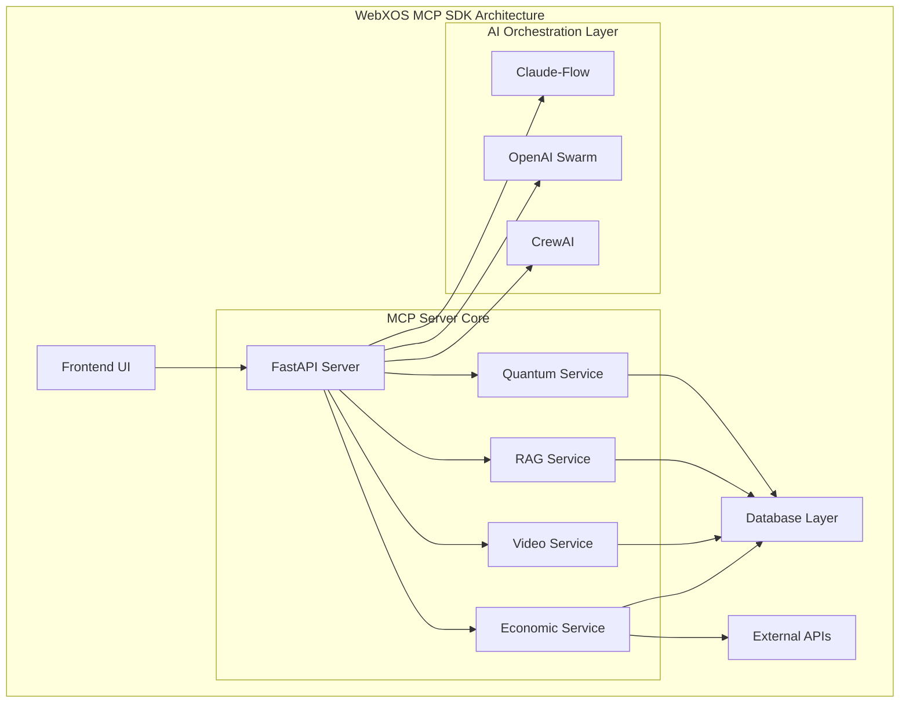

# 🌌 **WebXOS 2025 Vial MCP SDK: AI-Powered Quantum Frontier (OPEN SOURCE BETA)**

Welcome to the **WebXOS 2025 Vial Model Context Protocol (MCP) SDK**, a quantum-distributed, AI-orchestrated powerhouse hosted on GitHub! Powered by **Claude-Flow v2.0.0 Alpha**, **OpenAI Swarm**, and **CrewAI**, this SDK fuses 4x Vial agents, PyTorch cores, SQLAlchemy databases, and `.md` wallet functions into a versatile toolkit.

## ✨ Key Features

### 🎯 Modes of Operation

| Mode | Description | Visualization |
|------|-------------|---------------|
| **⚛️ SVG Diagram Mode** | 8-Point Quantum Neural Network Training (Coming Soon) |
| **🚚 Dropship Simulation Mode** | REST API & OBS Streaming (Coming Soon) | 
| **🌠 GalaxyCraft Mode** | Space Exploration & Swarm Gaming (Coming Soon) | 

### 🧠 AI Integration

Our SDK integrates multiple AI orchestration frameworks:

- **🐝 Claude-Flow v2.0.0 Alpha**: 87+ MCP tools with hive-mind intelligence
- **🕸️ OpenAI Swarm**: Distributed AI coordination
- **🤖 CrewAI**: Task automation and optimization

## 🏗️ System Architecture



## 📊 Repository Structure (BETA DESIGN)

```
webxos-vial-mcp/
├── 📁 .github/workflows/         # CI/CD pipelines
├── 📁 .claude/                   # Claude-Flow configuration
├── 📁 .hive-mind/                # Hive-mind sessions
├── 📁 .swarm/                    # Swarm memory
├── 📁 docs/                      # Documentation & diagrams
│   ├── mcp-architecture.svg
│   ├── 8-point-quantum-network.svg
│   ├── galaxyquest-network.svg
│   └── claude-flow-hive-mind.svg
├── 📁 public/                    # Frontend assets
│   └── 📁 js/
├── 📁 server/                    # Backend code
│   ├── 📁 api/
│   ├── 📁 agents/
│   ├── 📁 models/
│   └── 📁 services/
├── 📁 claude-flow-integration/   # AI integration layer
├── index.html                    # Main UI
├── mcp.toml                      # MCP configuration
├── requirements.txt              # Python dependencies
├── package.json                  # Node.js dependencies
└── README.md                     # This file
```

## 🚀 Getting Started

### Prerequisites

- Node.js 18+ 
- Python 3.8+
- npm or yarn
- Git

## 📝 License

This project is licensed under the MIT License

## 📊 Front-end app Performance Metrics

| Metric | Low | High |
|--------|-------|--------|
| API Response Time | < 100ms | < 200ms |
| Memory Usage | 256MB | < 512MB |


<div align="center">

**🌌 Explore the future of AI orchestration with WebXOS 2025! 🌠**

</div>
