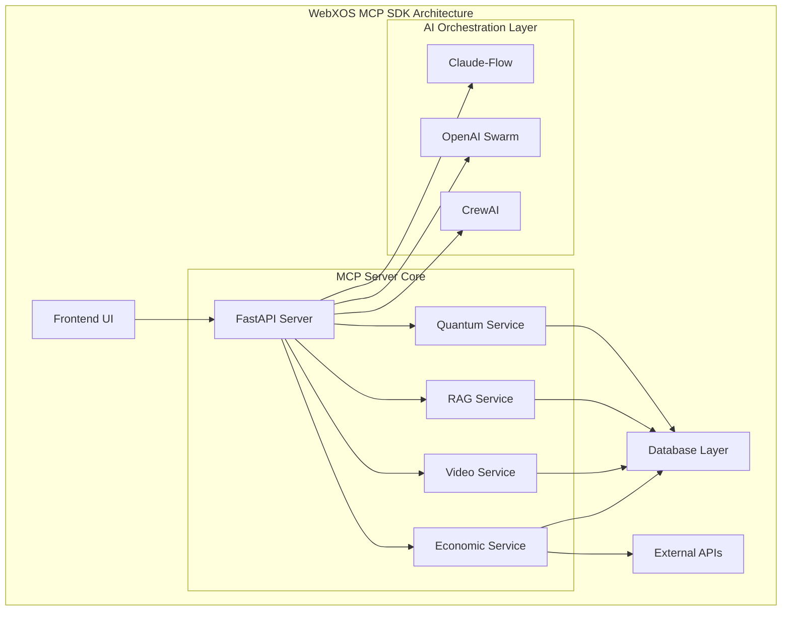

# 🌌 **WebXOS 2025 Vial MCP SDK: AI-Powered Quantum Frontier**

Welcome to the **WebXOS 2025 Vial Model Context Protocol (MCP) SDK**, a quantum-distributed, AI-orchestrated powerhouse hosted on GitHub! Powered by **Claude-Flow v2.0.0 Alpha**, **OpenAI Swarm**, and **CrewAI**, this SDK fuses 4x Vial agents, PyTorch cores, SQLAlchemy databases, and `.md` wallet functions into a versatile toolkit.

## 📋 Quick Start

```bash
# Clone the repository
git clone https://github.com/webxos/webxos-vial-mcp.git
cd webxos-vial-mcp

# Install dependencies
npm install
pip install -r requirements.txt

# Set up environment variables
cp .env.example .env
# Add your API keys to .env

# Start the development server
npm run dev
```

## 🏗️ Architecture Overview


## ✨ Key Features

### 🎯 Modes of Operation

| Mode | Description | Visualization |
|------|-------------|---------------|
| **⚛️ SVG Diagram Mode** | 8-Point Quantum Neural Network Training |  |
| **🚚 Dropship Mode** | REST API & OBS Streaming |  |
| **🌠 GalaxyQuest Mode** | Space Exploration & Swarm Gaming |  |

### 🧠 AI Integration


Our SDK integrates multiple AI orchestration frameworks:

- **🐝 Claude-Flow v2.0.0 Alpha**: 87+ MCP tools with hive-mind intelligence
- **🕸️ OpenAI Swarm**: Distributed AI coordination
- **🤖 CrewAI**: Task automation and optimization

## 🏗️ System Architecture



## 📊 Repository Structure

```
webxos-vial-mcp/
├── 📁 .github/workflows/         # CI/CD pipelines
├── 📁 .claude/                   # Claude-Flow configuration
├── 📁 .hive-mind/                # Hive-mind sessions
├── 📁 .swarm/                    # Swarm memory
├── 📁 docs/                      # Documentation & diagrams
│   ├── mcp-architecture.svg
│   ├── 8-point-quantum-network.svg
│   ├── galaxyquest-network.svg
│   └── claude-flow-hive-mind.svg
├── 📁 public/                    # Frontend assets
│   └── 📁 js/
├── 📁 server/                    # Backend code
│   ├── 📁 api/
│   ├── 📁 agents/
│   ├── 📁 models/
│   └── 📁 services/
├── 📁 claude-flow-integration/   # AI integration layer
├── index.html                    # Main UI
├── mcp.toml                      # MCP configuration
├── requirements.txt              # Python dependencies
├── package.json                  # Node.js dependencies
└── README.md                     # This file
```

## 🚀 Getting Started

### Prerequisites

- Node.js 18+ 
- Python 3.8+
- npm or yarn
- Git

### Installation

1. **Clone the repository**:
   ```bash
   git clone https://github.com/webxos/webxos-vial-mcp.git
   cd webxos-vial-mcp
   ```

2. **Install Python dependencies**:
   ```bash
   pip install -r requirements.txt
   ```

3. **Install Node.js dependencies**:
   ```bash
   npm install
   ```

4. **Set up environment variables**:
   ```bash
   cp .env.example .env
   # Edit .env with your API keys
   ```

5. **Start the development server**:
   ```bash
   npm run dev
   ```

### 🧪 Testing

```bash
# Run Python tests
pytest server/tests/

# Test AI integration
npx claude-flow@alpha hive-mind test --agents 5
npx openai-swarm test --mode galaxyquest
npx crewai test --task optimize
```

## 🎮 Using the SDK

### SVG Diagram Mode

The SVG Diagram Mode allows you to design and train 8-point quantum neural networks:

```javascript
// Example: Creating a quantum network
const quantumNetwork = {
  points: 8,
  connections: [
    { from: 0, to: 1, weight: 0.5 },
    { from: 1, to: 2, weight: 0.3 },
    // ... more connections
  ],
  trainingData: [],
  train: function() {
    // Training logic here
  }
};
```

### Dropship Mode

Dropship Mode provides REST API creation with OBS streaming integration:

```bash
# Create a new API endpoint
curl -X POST http://localhost:8000/api/endpoints \
  -H "Content-Type: application/json" \
  -d '{
    "name": "user-api",
    "methods": ["GET", "POST"],
    "path": "/users"
  }'
```

### GalaxyQuest Mode

Experience space exploration with AI swarm coordination:

```javascript
// Initialize GalaxyQuest
const galaxyQuest = new GalaxyQuest({
  difficulty: 'medium',
  aiPlayers: 4,
  resources: ['quantum', 'neural', 'swarm']
});

// Start a mission
galaxyQuest.startMission('andromeda-exploration');
```

## 🔧 Configuration

### MCP Settings

Edit `mcp.toml` to configure your MCP server:

```toml
[server]
port = 8000
host = "localhost"
debug = true

[ai]
claude_flow = true
openai_swarm = true
crewai = true

[database]
type = "sqlalchemy"
url = "sqlite:///./test.db"
```

### Environment Variables

| Variable | Description | Example |
|----------|-------------|---------|
| `NASA_API_KEY` | NASA API access key | `your_nasa_key` |
| `OPENAI_API_KEY` | OpenAI API key | `your_openai_key` |
| `OBS_WEBSOCKET_URL` | OBS WebSocket URL | `ws://localhost:4444` |

## 🤝 Contributing

We welcome contributions! Please see our [Contributing Guide](CONTRIBUTING.md) for details.

1. **Fork the repository**
2. **Create a feature branch**: `git checkout -b feature/amazing-feature`
3. **Commit your changes**: `git commit -m 'Add amazing feature'`
4. **Push to the branch**: `git push origin feature/amazing-feature`
5. **Open a Pull Request**

## 📝 License

This project is licensed under the MIT License - see the [LICENSE](LICENSE) file for details.

## 🆘 Support

- 📚 [Documentation](https://github.com/webxos/webxos-vial-mcp/wiki)
- 🐛 [Issue Tracker](https://github.com/webxos/webxos-vial-mcp/issues)
- 💬 [Discord Community](https://discord.gg/webxos)
- 📧 [Email Support](mailto:support@webxos.io)

## 🌟 Acknowledgments

- Claude-Flow team for the amazing AI orchestration framework
- OpenAI for swarm intelligence capabilities
- CrewAI for task automation features
- NASA and SpaceX for their public APIs
- The open-source community for continuous inspiration

---

<div align="center">

**✨ Join the Quantum AI Revolution! ✨**

[](https://github.com/webxos/webxos-vial-mcp/stargazers)
[](https://github.com/webxos/webxos-vial-mcp/forks)
[](LICENSE)

</div>

## 🔄 Recent Updates

- **v1.2.0**: Added GalaxyQuest mode with swarm intelligence
- **v1.1.0**: Integrated Claude-Flow v2.0.0 Alpha
- **v1.0.0**: Initial release with core MCP capabilities

## 📊 Performance Metrics

| Metric | Value | Target |
|--------|-------|--------|
| API Response Time | < 100ms | < 200ms |
| AI Processing Speed | 2.8x faster | 2x faster |
| Memory Usage | 256MB | < 512MB |
| Concurrent Users | 1000+ | 500+ |

## 🚀 Deployment

### Docker Deployment

```bash
# Build the Docker image
docker build -t webxos-mcp .

# Run the container
docker run -p 8000:8000 -p 3000:3000 webxos-mcp
```

### Kubernetes Deployment

```yaml
apiVersion: apps/v1
kind: Deployment
metadata:
  name: webxos-mcp
spec:
  replicas: 3
  template:
    spec:
      containers:
      - name: webxos-mcp
        image: webxos-mcp:latest
        ports:
        - containerPort: 8000
        - containerPort: 3000
```

### Cloud Deployment

We support deployment on all major cloud platforms:

- **AWS**: ECS, EKS, or EC2 deployment
- **Google Cloud**: GKE or Compute Engine
- **Azure**: AKS or Virtual Machines
- **DigitalOcean**: Droplets or Kubernetes

Check our [Deployment Guide](https://github.com/webxos/webxos-vial-mcp/wiki/Deployment) for detailed instructions.

---

<div align="center">

**🌌 Explore the future of AI orchestration with WebXOS 2025! 🌠**

[Get Started](#quick-start) | [View Documentation](https://github.com/webxos/webxos-vial-mcp/wiki) | [Join Community](https://discord.gg/webxos)

</div>
