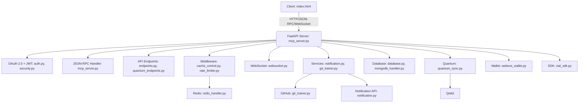
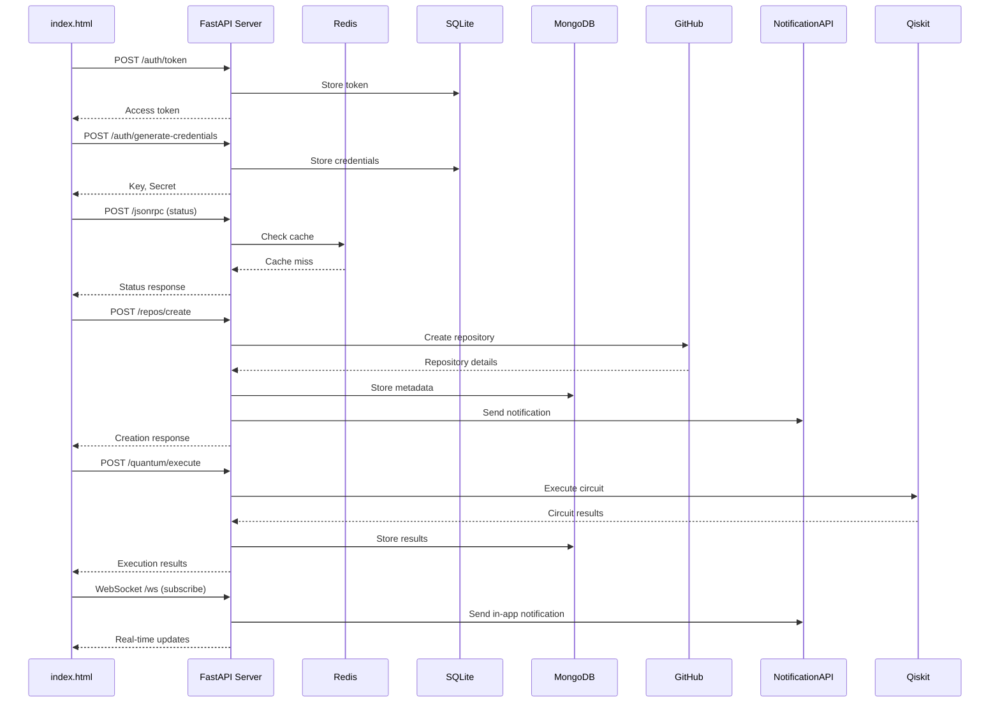

# Vial MCP Controller

The **Vial MCP Controller** is an open-source, FastAPI-based server designed for AI-driven task management, integrating with GitHub, MongoDB, SQLite, Redis, and quantum computing via Qiskit. It supports OAuth 2.0 for secure authentication and JSON-RPC 2.0 for standardized communication, making it ideal for developers building automation tools, quantum workflows, or notification systems. The project is modular, enabling users to fork and customize it for platforms like GitHub, GitLab, or custom integrations. The frontend is a single `public/index.html` file deployed via GitHub Pages, acting as a master key remote for the system.

## Project Goals

- **Modularity**: Extend with custom services, endpoints, or quantum backends.
- **Scalability**: Handle high-throughput API requests with Redis caching and rate limiting.
- **Community-Driven**: Encourage contributions for AI-driven features and quantum integrations.
- **Reliability**: Ensure production-ready deployments with CI/CD pipelines and testing.
- **Interoperability**: Integrate with platforms via OAuth 2.0 and JSON-RPC 2.0.

## Project Structure

```
vial.github.io/
├── server/
│   ├── api/
│   │   ├── auth.py
│   │   ├── cache_control.py
│   │   ├── copilot_integration.py
│   │   ├── docs.py
│   │   ├── endpoints.py
│   │   ├── health_check.py
│   │   ├── middleware.py
│   │   ├── quantum_endpoints.py
│   │   ├── rate_limiter.py
│   │   └── websocket.py
│   ├── automation/
│   │   ├── auto_deploy.py
│   │   └── auto_scheduler.py
│   ├── models/
│   │   ├── auth_agent.py
│   │   ├── mcp_alchemist.py
│   │   └── webxos_wallet.py
│   ├── quantum/
│   │   └── quantum_sync.py
│   ├── services/
│   │   ├── audit_log.py
│   │   ├── backup_restore.py
│   │   ├── database.py
│   │   ├── git_trainer.py
│   │   ├── mongodb_handler.py
│   │   ├── notification.py
│   │   └── redis_handler.py
│   ├── tests/
│   │   ├── test_auto_deploy.py
│   │   ├── test_backup_restore.py
│   │   ├── test_docs.py
│   │   ├── test_notification.py
│   │   ├── test_oauth2.py
│   │   ├── test_quantum_sync.py
│   │   └── test_redis_handler.py
│   ├── config.py
│   ├── error_handler.py
│   ├── logging.py
│   ├── mcp_server.py
│   ├── security.py
│   ├── utils.py
│   └── sdk/
│       └── vial_sdk.py
├── public/
│   └── index.html
├── .github/
│   ├── workflows/
│   │   ├── ci.yml
│   │   └── cd.yml
├── .env.example
├── .gitignore
├── Dockerfile
├── docker-compose.yml
├── pyproject.toml
├── requirements.txt
├── setup.py
├── LICENSE
└── README.md
```

## MCP Server Overview

The Vial MCP (Modular Control Plane) Controller is a FastAPI server that orchestrates AI-driven tasks, GitHub automation, quantum computing, and notifications. It uses a modular architecture for extensibility and scalability, with a single `public/index.html` frontend deployed via GitHub Pages, serving as the master key remote for the system.

### Key Components
- **FastAPI Server** (`server/mcp_server.py`): Handles HTTP, JSON-RPC 2.0, and WebSocket requests, with OAuth 2.0 authentication via `auth.py`.
- **GitHub Integration** (`server/services/git_trainer.py`): Automates repository creation, commits, and pull requests using GitHub API.
- **Database** (`server/services/database.py`, `server/services/mongodb_handler.py`): Manages data with SQLite (local) and MongoDB (cloud/local).
- **Caching** (`server/api/cache_control.py`): Uses Redis for low-latency API responses.
- **Quantum Computing** (`server/quantum/quantum_sync.py`): Executes Qiskit circuits via `/quantum/execute`.
- **Notifications** (`server/services/notification.py`): Sends alerts via email, Slack, or in-app methods.
- **Security** (`server/security.py`): Implements JWT (RS256) and CORS for production domains.
- **WebSocket** (`server/api/websocket.py`): Enables real-time updates for notifications and quantum results.
- **WebXOS Wallet** (`server/models/webxos_wallet.py`): Manages `$WEBXOS Balance` and `Reputation`.
- **SDK** (`server/sdk/vial_sdk.py`): Provides a Python client for API interaction.
- **GitHub Pages** (`public/index.html`): Single frontend file for UI, deployed via `.github/workflows/cd.yml`.

### Architecture Diagram



### Data Flow Diagram



## Setup Instructions

### Prerequisites
- **Python 3.11**: Install via [python.org](https://www.python.org/downloads/).
- **Docker**: Install [Docker Desktop](https://www.docker.com/products/docker-desktop/).
- **GitHub Account**: For forking and API tokens.
- **MongoDB**: Local or cloud instance (e.g., [MongoDB Atlas](https://www.mongodb.com/cloud/atlas)).
- **Redis**: Local or cloud instance (e.g., [Redis Labs](https://redislabs.com)).
- **Notification API**: Service like [SendGrid](https://sendgrid.com) or mock for in-app notifications.

### Forking and Local Development
1. **Fork the Repository**:
   ```bash
   git clone https://github.com/your-username/vial.github.io.git
   cd vial.github.io
   git remote add upstream https://github.com/vial.github.io.git
   ```
2. **Set Up Virtual Environment**:
   ```bash
   python -m venv venv
   source venv/bin/activate  # On Windows: venv\Scripts\activate
   ```
3. **Install Dependencies**:
   ```bash
   python -m pip install --upgrade pip
   pip install -r requirements.txt
   pip install flake8 pytest
   ```
4. **Configure Environment Variables**:
   Copy `.env.example` to `.env`:
   ```plaintext
   GITHUB_TOKEN=your_github_token
   GITHUB_USERNAME=your_github_username
   MONGO_URL=mongodb://localhost:27017
   REDIS_URL=redis://localhost:6379
   NOTIFICATION_API_URL=https://api.example.com/notify
   JWT_SECRET=your_jwt_secret
   API_BASE_URL=http://localhost:8000
   SQLITE_DB_PATH=/app/vial.db
   ```
   - **GitHub Token**: Generate at [GitHub Settings](https://github.com/settings/tokens) with `repo` scope.
5. **Run the Server Locally**:
   ```bash
   uvicorn server.mcp_server:app --host 0.0.0.0 --port 8000
   ```
   Access at `http://localhost:8000/docs` (Swagger UI) or `/redoc` (ReDoc).
6. **Run Docker Compose**:
   ```bash
   docker-compose up --build
   ```
7. **Run Tests**:
   ```bash
   pytest server/tests/ --verbose
   ```
8. **Run Linting**:
   ```bash
   flake8 . --max-line-length=88 --extend-ignore=E203
   ```
9. **Deploy Static Assets**:
   - Ensure `public/index.html` is populated.
   - Push to `main` to trigger GitHub Pages deployment via `.github/workflows/cd.yml`.

### Deployment Path
- **GitHub Pages**:
  - **Folder**: `public/index.html` (sole frontend).
  - **Config**: `.github/workflows/cd.yml` automates deployment.
  - **Steps**:
    - Enable GitHub Pages in repository settings (`Settings > Pages > Source: Deploy from a branch > Branch: main > /public`).
    - Push changes to `main`.
    - Access at `https://your-username.github.io/vial.github.io/`.
  - **API Hosting**: Host `server/` separately (e.g., on Heroku, AWS, or a VPS). Update `API_BASE_URL` in `.env` to point to the API domain.

### CI/CD Setup
1. **GitHub Secrets**:
   - `GITHUB_TOKEN`: Auto-generated for GitHub Actions.
   - `DOCKER_USERNAME`, `DOCKER_PASSWORD`: For Docker Hub (if using Docker).
2. **CI Pipeline**: `.github/workflows/ci.yml` runs linting and tests.
3. **CD Pipeline**: `.github/workflows/cd.yml` deploys `public/index.html` to GitHub Pages.

## APIs
- **POST /auth/token**: Authenticate users, returns access token.
- **POST /auth/generate-credentials**: Generate API key/secret for integrations.
- **GET /docs**, **GET /redoc**: Interactive API documentation.
- **POST /quantum/execute**: Execute Qiskit quantum circuits.
- **POST /repos/create**: Create GitHub repository.
- **POST /repos/commit**: Commit file to GitHub repository.
- **GET /help**: List available API commands.
- **POST /void**: Trigger placeholder void action.
- **POST /troubleshoot**: Run diagnostics.
- **POST /export**: Export wallet data.
- **POST /import**: Import wallet data.
- **WS /ws**: WebSocket for real-time updates.

## Use Cases
- **GitHub Automation**: Automate repository tasks via `git_trainer.py`.
- **Quantum Computing**: Run Qiskit simulations via `/quantum/execute`.
- **Notifications**: Send real-time alerts via `notification.py` and `/ws`.
- **Wallet Management**: Track `$WEBXOS Balance` and `Reputation` via `webxos_wallet.py`.
- **Custom Integrations**: Extend for Slack, AWS, etc.
- **Scalable API**: Use `cache_control.py` and `rate_limiter.py` for high-throughput APIs.

## Troubleshooting
- **Flake8 Errors**:
  - **F401 (unused import)**: Remove unused imports.
  - **E302 (missing blank lines)**: Add 2 blank lines before class/function definitions.
  - **E501 (line too long)**: Wrap lines to 88 characters. Example:
    ```python
    response = await client.post(
        "/quantum/execute",
        json={"circuit": circuit, "backend": backend}
    )
    ```
- **GitHub Pages Failure**:
  - **Symptom**: 404 error on `https://your-username.github.io/vial.github.io/`.
  - **Solution**: Ensure `public/index.html` exists. Verify `.github/workflows/cd.yml` and GitHub Pages settings.
- **API Connection Error**:
  - **Symptom**: `index.html` fails to connect to API.
  - **Solution**: Update `API_BASE_URL` in `.env` to your API domain.
- **WebSocket Failure**:
  - **Symptom**: `/ws` connection drops.
  - **Solution**: Ensure `websocket.py` is loaded in `mcp_server.py` and Redis is running.

## Contributing
1. Fork and create a feature branch (`git checkout -b feature/your-feature`).
2. Ensure flake8 compliance (`flake8 . --max-line-length=88 --extend-ignore=E203`).
3. Write tests in `server/tests/` and verify with `pytest server/tests/`.
4. Commit (`git commit -m "Add feature"`) and push (`git push origin feature/your-feature`).
5. Open a pull request to `main`.

## License
MIT License